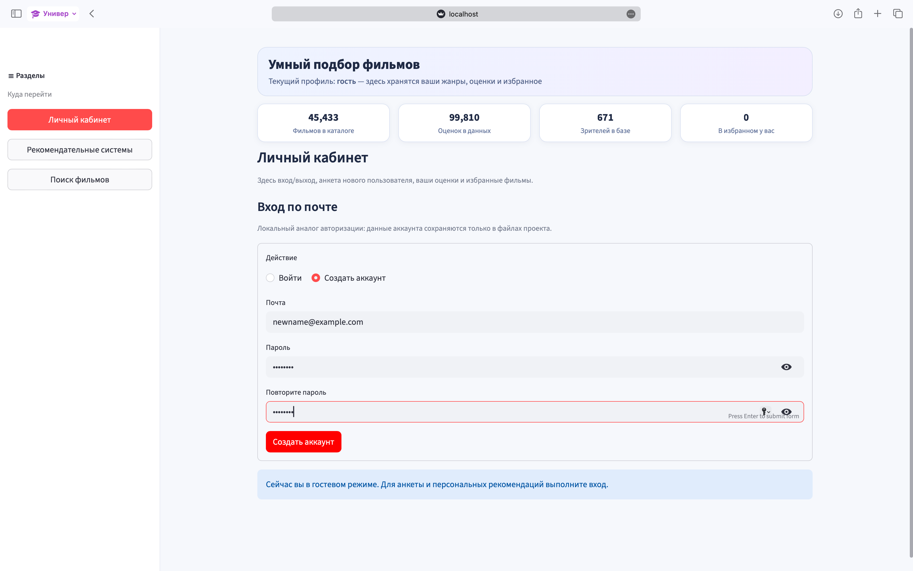
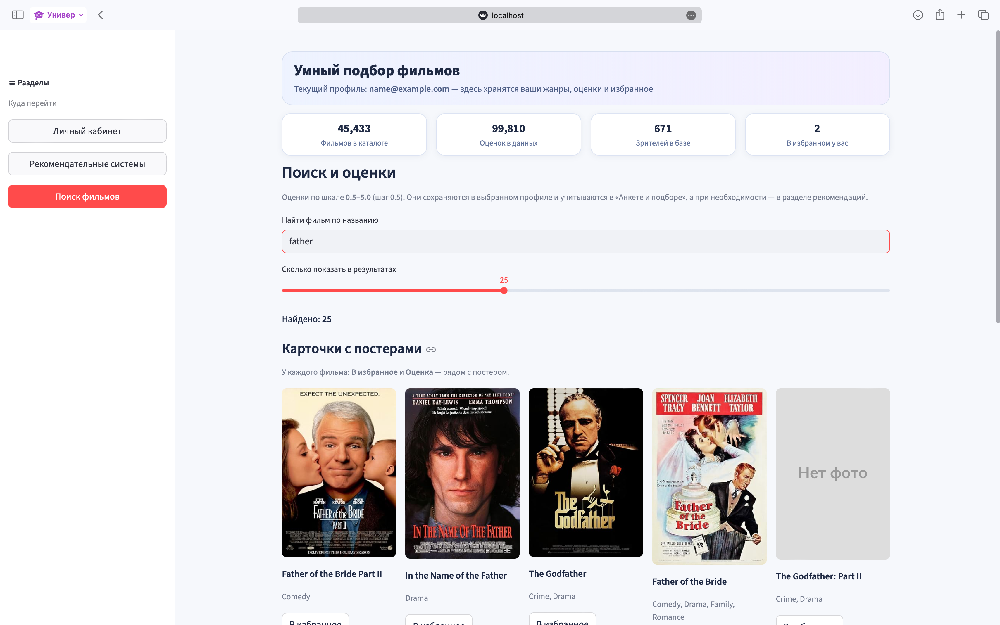
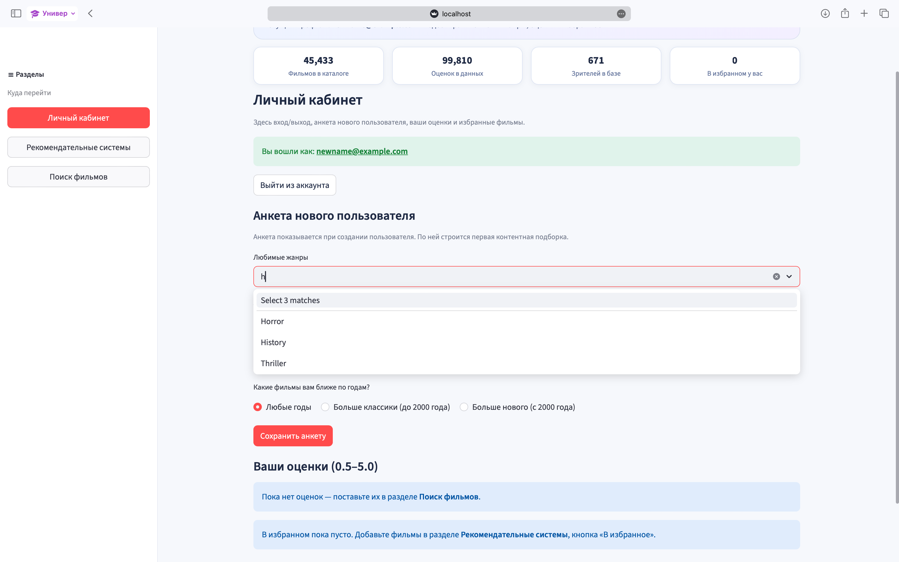
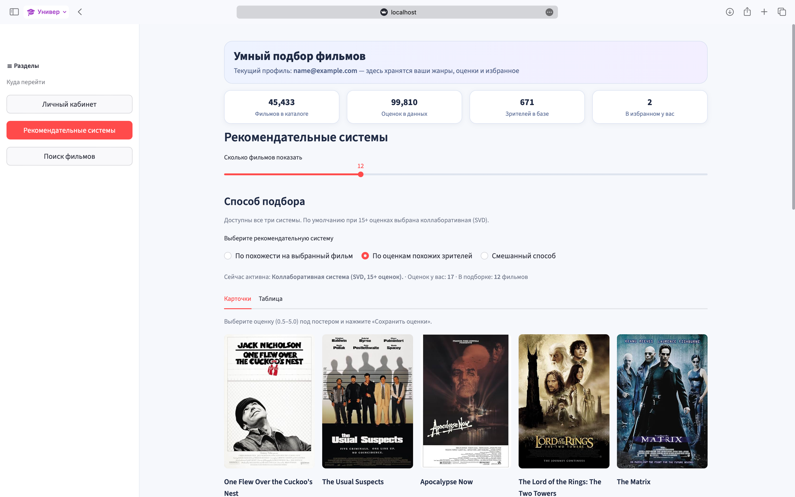
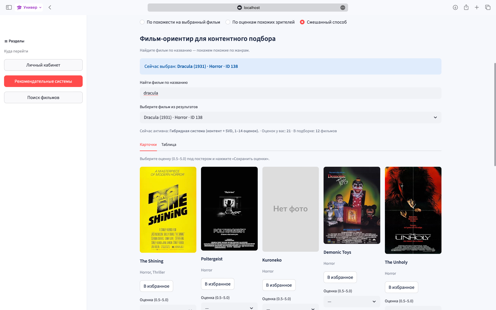
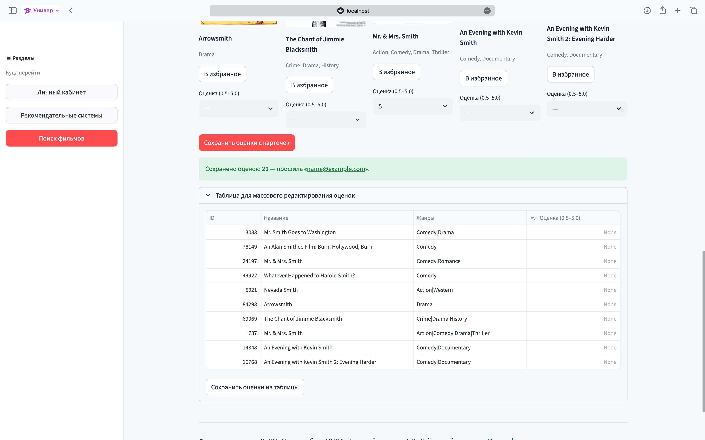

# Movie Recommendation System


Movie dataset preparation, a PostgreSQL/SQLite schema, and four recommendation
approaches (content-based, SVD, LightFM, LightGCN) built on
[The Movies Dataset](https://www.kaggle.com/datasets/rounakbanik/the-movies-dataset).

This branch (`feature/dev`) holds active development: model implementations,
database tooling, evaluation, and a Streamlit UI. The `main` branch holds an
earlier baseline (SVD + FAISS hybrid recommender) and is kept as-is.

## Table of Contents

- [Structure](#structure)
- [Architecture](#architecture)
- [Data Contract](#data-contract)
- [Setup](#setup)
- [Data Preparation](#data-preparation)
- [Models](#models)
- [Evaluation](#evaluation)
- [Results](#results)
- [Demo & Screenshots](#demo--screenshots)
- [Future Work](#future-work)
- [License](#license)

## Structure

```
app.py          Streamlit UI — login/profile, search, and all four recommendation strategies
data/           check.py, dataloader.py — local data utilities (raw/processed CSVs are not committed)
database/       schema, cleaning script, integrity checks, ER diagram — see database/README.MD
etl/            etl_pipeline.py — loads processed CSVs into database/recommender.db (SQLite)
models/         4 recommendation models + cold-start questionnaire + router — see models/README.md
evaluation/     shared metrics (Precision@K, Recall@K, NDCG@K) + evaluation/compare_models.py
UI_screens/     screenshots of the Streamlit app (auth, search, cold start, collaborative, hybrid)
docs/demo/      exported standalone HTML builds of the UI
```

## Architecture

```
Raw Movies Dataset (Kaggle)
        │
        ▼
database/clean_movies_data.py  ──▶  data/processed/*.csv  (TMDB-keyed)
        │
        ▼
etl/etl_pipeline.py  ──▶  database/recommender.db (SQLite) / PostgreSQL (database/schema.sql)
        │
        ▼
   models/  ──┬── content_based.py     (TF-IDF / SentenceTransformer + FAISS)
              ├── svd_model.py         (truncated SVD)
              ├── lightfm_model.py     (factorization machines, WARP loss)
              └── lightgcn_model.py    (graph convolution, BPR loss)
        │
        ├──▶ evaluation/compare_models.py  ──▶  Precision@K / Recall@K / NDCG@K
        │
        └──▶ models/recommendation_router.py  ──▶  app.py (Streamlit UI)
```

New users are routed by rating count — new → cold start → warm start → mature
— through [`models/recommendation_router.py`](models/recommendation_router.py),
which picks a strategy per lifecycle stage. See
[models/README.md](models/README.md) for the full routing table.

## Data Contract

Movie identity across the whole project is the TMDB id:

```text
movies.movie_id  = TMDB id
ratings.movie_id = TMDB id
ratings.movielens_id = original MovieLens movieId (kept for traceability only)
```

See [database/database_architecture.md](database/database_architecture.md) for the full table layout.

## Setup

```powershell
pip install -r requirements.txt
```

`requirements.txt` covers the classic stack (pandas, scikit-learn, LightFM,
Streamlit) plus PyTorch + PyTorch Geometric for LightGCN.

## Data Preparation

```powershell
python database/clean_movies_data.py --input data/raw --output data/processed
```

Reads the raw Movies Dataset CSVs (`movies_metadata.csv`, `credits.csv`,
`keywords.csv`, `ratings.csv`, `links.csv`) and writes the cleaned,
TMDB-keyed CSVs consumed by every model and by the SQL schema.

## Models

Four approaches live in `models/`, meant to be compared rather than picked
as a single "winner":

| Model | File | Approach |
|---|---|---|
| Content-Based | `models/content_based.py` | SentenceTransformer embeddings over title + genres + year, cosine similarity / FAISS |
| SVD | `models/svd_model.py` | Classic matrix factorization (scipy truncated SVD) |
| LightFM | `models/lightfm_model.py` | Factorization machines, WARP loss, interaction data only |
| LightGCN | `models/lightgcn_model.py` | Graph convolution over the user-item bipartite graph, BPR loss |

`evaluation/compare_models.py` additionally benchmarks a lightweight
TF-IDF content-based baseline and a LightFM + item-features hybrid variant
alongside these four — see [Evaluation](#evaluation) below.

Cold-start users are handled separately by `models/cold_start_questionnaire.py`
and routed through the lifecycle stages (new → cold start → warm start →
mature) in `models/recommendation_router.py`. Details, parameters, and
recorded results: [models/README.md](models/README.md).

## Evaluation

```powershell
python evaluation/compare_models.py
```

Runs Content-Based (TF-IDF), SVD, LightFM Collaborative, LightFM Hybrid, and
LightGCN on the exact same preprocessed data (implicit interactions, rating
>= 4.0, 80/20 split per user) and reports Precision@K, Recall@K, NDCG@K for
K = 10, 20. Training exposure per epoch is equalized across models — see
[models/README.md](models/README.md) for the full protocol and methodology
notes (how LightGCN's epoch budget was aligned with LightFM's, and why the
benchmarked "Content-Based (TF-IDF)" differs from `models/content_based.py`).

Metric implementations: `evaluation/metrics.py`.

## Results

<!-- TODO: fill in after the next full evaluation run on GPU. -->

| Model | P@10 | R@10 | NDCG@10 | Train time |
|---|---|---|---|---|
| Content-Based (TF-IDF) | TBD | TBD | TBD | TBD |
| SVD | TBD | TBD | TBD | TBD |
| LightFM Collaborative | TBD | TBD | TBD | TBD |
| LightFM Hybrid | TBD | TBD | TBD | TBD |
| LightGCN | TBD | TBD | TBD | TBD |

Full metrics (P@10/20, R@10/20, NDCG@10/20, inference latency) and the
production-fit analysis (cold-start handling, scalability, real-time
serving, update cost) are printed by `evaluation/compare_models.py` and
discussed in [models/README.md](models/README.md).

## Demo & Screenshots

`docs/demo/` contains exported standalone HTML builds of the UI
(`movie-recommendation-system.html` and a compressed variant).

| | |
|---|---|
|  Login |  Search |
|  Cold-start questionnaire |  Collaborative recommendations |
|  Hybrid recommendations |  Personal account / rating history |

More screenshots (auth flow, content-based results, before/after
collaborative filtering comparisons) are in [UI_screens/](UI_screens/).

## Future Work

- Load-testing and scalability benchmarks for the production-fit analysis
  (currently qualitative only — see `models/README.md`)
- Wire the SentenceTransformer + FAISS content engine (`models/content_based.py`)
  into `evaluation/compare_models.py` for a stronger content-based baseline
- Hyperparameter tuning pass for LightGCN and LightFM Hybrid beyond the
  current fixed configuration

## License

[MIT](LICENSE)
