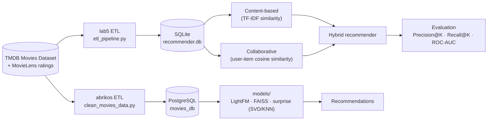

# 🎬 Movie Recommendation System

A movie recommender built on **TMDB's *Movies Dataset*** and **MovieLens**, exploring content-based, collaborative, and hybrid filtering — with full data-engineering pipelines (PostgreSQL & SQLite) and offline evaluation. Built for the *Recommender Systems & Collaborative Filtering* course.

[](https://www.python.org/)
[](LICENSE)
[](https://github.com/feuerstrahll/recommendation-system-movies/commits/main)

---

## Project at a Glance

| | | | |
|:---:|:---:|:---:|:---:|
| **45K+** movies | **270K+** ratings | **671** MovieLens users | **20+** features per movie |

Four recommendation approaches were designed and compared for this project — **content-based**, **collaborative (LightFM)**, **hybrid**, and **graph-based (LightGCN)** — with the collaborative/hybrid LightFM approach selected as the production candidate (ROC AUC **0.7277**, ~1s CPU inference). See [Models Explored & Results](#models-explored--results) below.

## Table of Contents

- [Overview](#overview)
- [Repository Structure](#repository-structure)
- [Implementation Status](#implementation-status)
- [Architecture (as built)](#architecture-as-built)
- [Components](#components)
- [Models Explored & Results](#models-explored--results)
- [Cold-Start & Production Strategy](#cold-start--production-strategy)
- [Datasets](#datasets)
- [Final Presentation](#final-presentation)
- [Team](#team)
- [Getting Started](#getting-started)
- [Roadmap](#roadmap)
- [Contributing](#contributing)
- [License](#license)
- [Acknowledgments](#acknowledgments)

## Overview

This repository documents the evolution of a movie recommendation system, from raw data cleaning to a set of evaluated recommenders. It contains three components, each usable on its own:

| Component | What it does | Storage |
|---|---|---|
| [`abrikos/`](abrikos) | Cleans the raw TMDB *Movies Dataset* and loads it into PostgreSQL | PostgreSQL |
| [`models/`](models) | Experiments with collaborative filtering (LightFM, `surprise`), content embeddings (Sentence-Transformers), and FAISS similarity search | CSV / in-memory |
| [`recommendation-system-lab5/`](recommendation-system-lab5) | End-to-end lab pipeline: ETL, SQLite schema, content-based / collaborative / hybrid recommenders, offline evaluation, demo | SQLite |

The team's final project presentation additionally covers a progressive cold-start strategy, a LightGCN graph model, and a full web application (auth, personal account, live recommendations) — see [Implementation Status](#implementation-status) for what's implemented here versus described as the project's fuller scope.

## Repository Structure

```text
recommendation-system-movies/
├── abrikos/                       # Cleaning + PostgreSQL loading scripts
│   ├── clean_movies_data.py
│   ├── load_to_postgres.py
│   ├── check_db.py
│   ├── schema.sql
│   └── README.md
├── models/                        # Model experimentation
│   ├── model_creation.ipynb       # SVD/KNN (surprise), FAISS similarity search
│   ├── lightfm_model.py           # Collaborative filtering with LightFM
│   ├── content_lightFM.py         # Content-based embeddings (Sentence-Transformers) + LightFM
│   ├── lightfm_roc_curve.png
│   └── README.md
├── recommendation-system-lab5/    # Structured, evaluated recommender pipeline
│   ├── data/                      # raw/ (user-supplied) and processed/ (cleaned CSVs)
│   ├── database/                  # SQLite schema, ER diagram, database file
│   ├── etl/                       # ETL pipeline (MovieLens -> SQLite)
│   ├── recommender/               # content_based.py, collaborative.py, hybrid.py
│   ├── evaluation/                # Precision@K, Recall@K
│   ├── report/                    # Lab report
│   ├── demo.py
│   └── README.md
├── docs/
│   └── presentation.html          # Final project presentation (slide deck)
├── LICENSE
├── CONTRIBUTING.md
├── .gitignore
└── README.md
```

## Implementation Status

The final presentation covers more ground than this specific repository snapshot — this table is here so the README doesn't overclaim. ✅ means working code exists in this repo; 📝 means it's part of the project's design/final report but isn't (yet) committed here.

| Component | Description | Status | Location |
|---|---|---|---|
| Content-based (TF-IDF) | Genre similarity via TF-IDF + cosine similarity | ✅ Implemented | `recommendation-system-lab5/recommender/content_based.py` |
| Content-based (embeddings) | Sentence-Transformer title/genre embeddings + LightFM | ✅ Implemented | `models/content_lightFM.py` |
| Collaborative (cosine) | User-item matrix + cosine similarity | ✅ Implemented | `recommendation-system-lab5/recommender/collaborative.py` |
| Collaborative (LightFM) | LightFM WARP loss over interactions | ✅ Implemented | `models/lightfm_model.py` |
| Hybrid (weighted) | Weighted combination of content + collaborative scores | ✅ Implemented | `recommendation-system-lab5/recommender/hybrid.py` |
| Hybrid (SVD + FAISS) | SVD candidate re-ranking over a FAISS content pool | 📝 Described in presentation | — |
| LightGCN (GNN) | Graph convolutional model over the user–item bipartite graph | 📝 Described in presentation | — |
| Unified Recommendation Router | Progressive cold-start → hybrid → collaborative switching | 📝 Described in presentation | — |
| Cold-start questionnaire | Genre/movie/year preference form for new users | 📝 Described in presentation | — |
| Web UI (auth, personal account, search) | Full front-end for all recommendation types | 📝 Described in presentation | — |
| Production backend (FastAPI + Redis) | Serving layer with caching and background retraining | 📝 Described in presentation | — |
| Offline evaluation (Precision@K, Recall@K) | Metrics module for the lab recommenders | ✅ Implemented | `recommendation-system-lab5/evaluation/metrics.py` |

If the router/LightGCN/UI/backend code lives in another repository, link it here (or add it to this one) and this table can be updated to ✅ across the board.

## Architecture (as built)

The three in-repo components map onto the standard recommender-system pipeline: ingest raw data, store it, model it, evaluate the output.



## Components

### 1. `abrikos/` — Data Cleaning & PostgreSQL ETL

Cleans the raw *Movies Dataset* CSVs (metadata, credits, keywords, ratings, links) and loads the normalized result into PostgreSQL, using the schema in [`abrikos/schema.sql`](abrikos/schema.sql).

```bash
cd abrikos
pip install -r requirements.txt
python clean_movies_data.py --input ./data_Movies --output ./cleaned_data
python load_to_postgres.py --host localhost --port 5432 \
    --db movies_db --user postgres --password secret \
    --data ./cleaned_data --schema ./schema.sql
python check_db.py --db movies_db --user postgres --password secret
```

See [`abrikos/README.md`](abrikos/README.md).

### 2. `models/` — Model Experiments

Notebook and scripts comparing LightFM collaborative filtering, Sentence-Transformer content embeddings, and FAISS similarity search.

```bash
cd models
pip install -r requirements.txt
python lightfm_model.py
```

See [`models/README.md`](models/README.md) for pipeline logs and metrics from past runs.

### 3. `recommendation-system-lab5/` — Structured Recommender Lab

A SQLite-backed pipeline with content-based, collaborative, and hybrid recommenders plus offline evaluation.

```powershell
cd recommendation-system-lab5
python -m venv .venv
.\.venv\Scripts\Activate.ps1
pip install -r requirements.txt
python demo.py
```

See [`recommendation-system-lab5/README.md`](recommendation-system-lab5/README.md) and the [lab report](recommendation-system-lab5/report/lab5_report.md).

## Models Explored & Results

Comparison criteria and results as evaluated for the final project (see [Implementation Status](#implementation-status) for what has corresponding code in this repo):

| Criterion | Content-Based | LightFM (Collab) | Hybrid | LightGCN (GNN) |
|---|---|---|---|---|
| Quality (mature user) | Medium | High | High | High |
| Cold start | Excellent | Doesn't work | Partial | Doesn't work |
| Training speed | Seconds | ~30s | Minutes | 1–3 min (CPU) |
| Inference speed | <0.1s | ~1s | ~0.5s | 1–3s |
| Scalability | FAISS | Good | Medium | Needs GPU |
| Real-time updates | Yes | Requires retraining | Partial | Requires retraining |
| Explainability | High | Medium | Medium | Low |
| **Chosen for production** | Cold start | ✓ Primary | ✓ Warm start | Experimental |

**LightFM (collaborative)** — ROC AUC **0.7277** (500-user sample), ~30s training, ~1s CPU inference. See [`models/README.md`](models/README.md) for full run logs.

**LightGCN (GNN)** — evaluated at 610 users, CPU, 20 epochs:

| Metric | @K=10 | @K=20 |
|---|---|---|
| Precision@K | 0.0324 | 0.0198 |
| Recall@K | 0.0652 | 0.0823 |
| NDCG@K | 0.0421 | 0.0527 |

> LightGCN was evaluated as part of the final project comparison but its implementation isn't included in this repository — see [Implementation Status](#implementation-status).

**Production choice:** LightFM (collaborative/hybrid) was selected over LightGCN — comparable quality, CPU-only inference at ~1s, simpler retraining, and better cold-start support via side features, versus LightGCN's GPU dependency and lower explainability.

## Cold-Start & Production Strategy

The final presentation describes a **Unified Recommendation Router** that progressively switches strategy as a user accumulates ratings:

| Stage | Ratings | Strategy |
|---|---|---|
| 1. New user | 0 | Onboarding questionnaire (genres, favorite movies, release-year preference) |
| 2. Cold start | 1–5 | Content-based (metadata similarity) |
| 3. Warm start | 5–15 | Hybrid: `hybrid_score = α·svd_score_norm + (1−α)·content_score_norm` |
| 4. Mature | 15+ | Collaborative (LightFM) |

Planned production architecture: **FastAPI + Gunicorn** for serving, **Redis** for caching user embeddings, **FAISS** for nearest-neighbor search, background batch retraining, and `ratings` partitioned by `user_id`. As noted above, the router, questionnaire, and serving layer are part of the project's design rather than code currently in this repository.

## Datasets

- **[The Movies Dataset](https://www.kaggle.com/datasets/rounakbanik/the-movies-dataset)** (TMDB metadata, credits, keywords) — 45K+ movies, 20+ features each. Used by `abrikos/` and `models/`.
- **[MovieLens](https://grouplens.org/datasets/movielens/)** (user ratings) — 671 users, 270K+ ratings. Used by all three components.

Raw source files are **not** committed (see `data/raw/.gitkeep` in the lab folder) — download them from the links above. Cleaned/processed CSVs used by the lab pipeline are committed under `recommendation-system-lab5/data/processed/`.

> **Note:** `recommendation-system-lab5/database/recommender.db` (~41 MB) and the processed CSVs (~25 MB combined) are currently committed. Consider regenerating them locally via the ETL scripts instead of committing binary/data artifacts going forward, or track them with [Git LFS](https://git-lfs.com/).

## Team

| Member | Role |
|---|---|
| Anastasiia Putintseva | Data preprocessing · recommender model implementation |
| Kirill Kononov | UI development · UI testing & QA |
| Denis Belkov | Recommender algorithm research & implementation · testing & QA |
| Denis Orlovsky | PostgreSQL database design & administration |

## Getting Started

Each component is self-contained with its own `requirements.txt`. Clone the repo, then `cd` into the component you want to run (Python 3.10+ recommended).

```bash
git clone https://github.com/feuerstrahll/recommendation-system-movies.git
cd recommendation-system-movies
```

## Roadmap

- [ ] Implement the Unified Recommendation Router and progressive cold-start strategy described in the presentation.
- [ ] Add the LightGCN model and the SVD+FAISS hybrid re-ranker.
- [ ] Build the web UI (auth, personal account, search) and a FastAPI serving layer.
- [ ] Fill in `recommendation-system-lab5/report/lab5_report.md` with final dataset stats and results.
- [ ] Add automated tests for `recommender/` and `evaluation/` modules.

## Contributing

Contributions, bug reports, and suggestions are welcome — see [CONTRIBUTING.md](CONTRIBUTING.md).

## License

Distributed under the MIT License. See [LICENSE](LICENSE) for details.

## Acknowledgments

- [The Movies Dataset](https://www.kaggle.com/datasets/rounakbanik/the-movies-dataset) by Rounak Banik
- [MovieLens](https://grouplens.org/datasets/movielens/) by GroupLens Research
- [LightFM](https://github.com/lyst/lightfm), [FAISS](https://github.com/facebookresearch/faiss), [scikit-surprise](http://surpriselib.com/), [Sentence-Transformers](https://www.sbert.net/)
