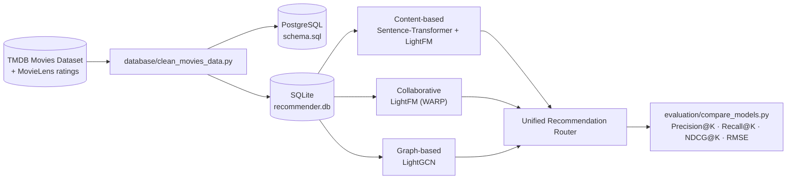

# 🎬 Movie Recommendation System

A movie recommender built on **TMDB's *Movies Dataset*** and **MovieLens**, comparing content-based, collaborative (LightFM), hybrid, and graph-based (LightGCN) approaches — with a full ETL pipeline, offline evaluation, and a progressive cold-start strategy. Built for the *Recommender Systems & Collaborative Filtering* course.

[](https://www.python.org/)
[](LICENSE)
[](https://github.com/feuerstrahll/recommendation-system-movies/commits/feature/dev)

> **Branch note:** this README describes the `feature/dev` branch, which contains substantially more implemented work (LightGCN, the cold-start questionnaire, the recommendation router, and a full model-comparison script) than `main`. See [Branches](#branches) before merging.

---

## Project at a Glance

| | | | |
|:---:|:---:|:---:|:---:|
| **45K+** movies | **270K+** ratings | **671** MovieLens users | **20+** features per movie |

Four recommendation approaches are implemented and compared — **content-based**, **collaborative (LightFM)**, **hybrid (LightFM + item features)**, and **graph-based (LightGCN)** — with a **Unified Recommendation Router** that switches between them as a user moves from a brand-new signup to a data-rich, mature account.

## Table of Contents

- [Overview](#overview)
- [Repository Structure](#repository-structure)
- [Implementation Status](#implementation-status)
- [Architecture](#architecture)
- [Components](#components)
- [Models & Results](#models--results)
- [Cold-Start Strategy](#cold-start-strategy)
- [Datasets](#datasets)
- [Final Presentation](#final-presentation)
- [Team](#team)
- [Getting Started](#getting-started)
- [Branches](#branches)
- [Roadmap](#roadmap)
- [Contributing](#contributing)
- [License](#license)
- [Acknowledgments](#acknowledgments)

## Overview

Everything lives under [`recommendation-system-lab5/`](recommendation-system-lab5): data cleaning and a PostgreSQL/SQLite schema ([`database/`](recommendation-system-lab5/database)), four recommender implementations ([`models/`](recommendation-system-lab5/models)), offline evaluation across all of them ([`evaluation/`](recommendation-system-lab5/evaluation)), and screenshots of a working demo UI ([`UI_screens/`](recommendation-system-lab5/UI_screens)).

## Repository Structure

```text
recommendation-system-movies/  (feature/dev)
├── movie-recommendation-system.html   # Final project presentation (slide deck)
├── recommendation-system-lab5/
│   ├── data/
│   │   ├── raw/                       # user-supplied source CSVs (not committed)
│   │   ├── processed/                 # cleaned CSVs (movies, ratings, cast, crew, keywords, links)
│   │   ├── check.py                   # verifies keyword FK integrity
│   │   └── dataloader.py              # downloads "The Movies Dataset" from Kaggle
│   ├── database/
│   │   ├── clean_movies_data.py       # raw CSV -> cleaned CSVs
│   │   ├── check_db.py                # verifies PostgreSQL schema + referential integrity
│   │   ├── schema.sql                 # PostgreSQL schema (movie_id = TMDB id)
│   │   ├── database_architecture.md
│   │   ├── er_diagram.mmd
│   │   ├── recommender.db             # SQLite snapshot for local experiments
│   │   └── README.md
│   ├── etl/
│   │   └── etl_pipeline.py            # MovieLens -> SQLite
│   ├── models/
│   │   ├── content_lightFM.py         # content-based: Sentence-Transformer embeddings + LightFM
│   │   ├── lightfm_model.py           # collaborative: LightFM (WARP loss)
│   │   ├── lightgcn_model.py          # graph-based: LightGCN (PyTorch Geometric)
│   │   ├── cold_start_questionnaire.py# onboarding questionnaire + content-based cold start
│   │   ├── cold_start_examples.py     # usage examples for the questionnaire/router
│   │   ├── recommendation_router.py   # Unified Recommendation Router (stage-based switching)
│   │   ├── lightfm_roc_curve.png
│   │   ├── model_creation.ipynb       # SVD/KNN (surprise) + FAISS exploration
│   │   └── README.md
│   ├── evaluation/
│   │   ├── metrics.py                 # Precision@K, Recall@K, NDCG@K
│   │   ├── compare_models.py          # evaluates all 4 models side by side
│   │   ├── lightfm_rmse_solution.py   # RMSE/MAE for LightFM via score normalization
│   │   └── README.md
│   ├── UI_screens/                    # 27 screenshots of a working demo UI (no source committed)
│   ├── LIGHTGCN_QUICKSTART.md
│   ├── LIGHTGCN_INTEGRATION_CHECKLIST.md
│   ├── LIGHTGCN_COMPLETE.md
│   ├── install_lightgcn_deps.bat
│   ├── lightgcn_examples.py
│   ├── requirements.txt
│   └── README.md
├── LICENSE
├── CONTRIBUTING.md
├── .gitignore
└── README.md
```

## Implementation Status

✅ = working code in this branch. 📝 = designed/specified (docstrings, test plans, or the presentation) but not implemented as code. 🖼️ = evidenced by screenshots only, source not committed.

| Component | Status | Location |
|---|---|---|
| Content-based (TF-IDF) | ✅ | `recommendation-system-lab5/models/model_creation.ipynb` |
| Content-based (Sentence-Transformer + LightFM) | ✅ | `models/content_lightFM.py` |
| Collaborative (LightFM, WARP) | ✅ | `models/lightfm_model.py` |
| Hybrid (LightFM + item features) | ✅ | `models/lightfm_model.py` / `content_lightFM.py` |
| Graph-based (LightGCN) | ✅ | `models/lightgcn_model.py` |
| Cold-start questionnaire | ✅ | `models/cold_start_questionnaire.py` |
| Unified Recommendation Router | ✅ (hybrid/collaborative branches partially stubbed — see file) | `models/recommendation_router.py` |
| Offline evaluation (Precision/Recall/NDCG@K, all 4 models) | ✅ | `evaluation/compare_models.py` |
| RMSE/MAE for LightFM | ✅ | `evaluation/lightfm_rmse_solution.py` |
| Hybrid (SVD + FAISS re-ranking, `alpha` parameter) | 📝 Documented as a design/test plan in `models/README.md` | not implemented |
| Web UI (auth, personal account, search, all 3 recommendation types) | 🖼️ Screenshots only | `UI_screens/` (27 images, no source) |
| Production backend (FastAPI + Redis) | 📝 Described in presentation | not implemented |

The router's `_recommend_hybrid` and `_recommend_collaborative` methods currently have `TODO` fallbacks to content-based recommendations rather than calling the LightFM/LightGCN models directly — see [`models/recommendation_router.py`](recommendation-system-lab5/models/recommendation_router.py) if you pick this up.

## Architecture



## Components

### Database & ETL — `recommendation-system-lab5/database/`

Cleans the raw *Movies Dataset* CSVs and produces both a PostgreSQL schema and a SQLite snapshot, keyed on `movie_id` (TMDB id), with `movielens_id` preserved as a reference column on `ratings`.

```bash
cd recommendation-system-lab5
python database/clean_movies_data.py --input data/raw --output data/processed
psql -U postgres -d movies_db -f database/schema.sql
python database/check_db.py --db movies_db --user postgres --password secret
```

See [`database/README.md`](recommendation-system-lab5/database/README.md).

### Models — `recommendation-system-lab5/models/`

```bash
cd recommendation-system-lab5
pip install -r requirements.txt

python models/cold_start_questionnaire.py   # new-user onboarding
python models/recommendation_router.py      # demo: stage-based strategy switching
python models/lightfm_model.py              # collaborative filtering
python models/content_lightFM.py            # content-based
python models/lightgcn_model.py             # graph-based (needs torch + torch-geometric)
```

See [`models/README.md`](recommendation-system-lab5/models/README.md).

### Evaluation — `recommendation-system-lab5/evaluation/`

```bash
python evaluation/compare_models.py --models all --eval-users 300
```

Runs Precision@K / Recall@K / NDCG@K for all four models plus RMSE/MAE for the LightFM variants, and prints a production-suitability table. See [`evaluation/README.md`](recommendation-system-lab5/evaluation/README.md).

## Models & Results

| Criterion | Content-Based | LightFM (Collab) | Hybrid | LightGCN (GNN) |
|---|---|---|---|---|
| Quality (mature user) | Medium | High | High | High |
| Cold start | Excellent | Doesn't work | Partial | Doesn't work |
| Training speed | Seconds | ~30s | Minutes | 1–3 min (CPU) |
| Inference speed | <0.1s | ~1s | ~0.5s | 1–3s |
| Scalability | FAISS | Good | Medium | Needs GPU |
| Explainability | High | Medium | Medium | Low |
| **Chosen for production** | Cold start | ✓ Primary | ✓ Warm start | Experimental |

**LightFM (collaborative)** — ROC AUC **0.7277** (500-user sample), ~30s training, ~1s CPU inference.

**LightGCN (GNN)** — evaluated at 610 users, CPU, 20 epochs:

| Metric | @K=10 | @K=20 |
|---|---|---|
| Precision@K | 0.0324 | 0.0198 |
| Recall@K | 0.0652 | 0.0823 |
| NDCG@K | 0.0421 | 0.0527 |

Run `evaluation/compare_models.py` to reproduce a full side-by-side table (including RMSE/MAE for the LightFM variants) on your own data split. **Production choice:** LightFM was selected over LightGCN — comparable quality, CPU-only inference at ~1s, simpler retraining, and cold-start support via side features, versus LightGCN's GPU dependency and lower explainability.

## Cold-Start Strategy

`recommendation_router.py` implements a 4-stage lifecycle:

| Stage | Ratings | Strategy |
|---|---|---|
| New user | 0 | Onboarding questionnaire (`cold_start_questionnaire.py`) → content-based |
| Cold start | 1–5 | Content-based (metadata similarity) |
| Warm start | 5–20 | Hybrid (content + collaborative) |
| Mature | 20+ | Collaborative (LightFM / LightGCN) |

```python
from recommendation_router import UnifiedRecommendationRouter

router = UnifiedRecommendationRouter(movies, ratings)
router.register_new_user(user_id=42)
result = router.get_recommendations(user_id=42, n_recommendations=10)
# result.strategy   -> "content-based" / "hybrid" / "collaborative"
# result.user_stage -> UserStage.NEW / COLD_START / WARM_START / MATURE
```

As noted in [Implementation Status](#implementation-status), the hybrid and collaborative branches of the router currently fall back to content-based recommendations (marked `TODO` in the source) rather than calling LightFM/LightGCN directly.

## Datasets

- **[The Movies Dataset](https://www.kaggle.com/datasets/rounakbanik/the-movies-dataset)** (TMDB metadata, credits, keywords) — 45K+ movies, 20+ features each.
- **[MovieLens](https://grouplens.org/datasets/movielens/)** (user ratings) — 671 users, 270K+ ratings.

Raw source files aren't committed — `data/dataloader.py` downloads them from Kaggle via `kagglehub` and places them in `data/raw/`. Cleaned CSVs are committed under `data/processed/`.

> **Note:** `database/recommender.db` (~41 MB) and the processed CSVs are committed directly. Consider [Git LFS](https://git-lfs.com/) or regenerating them via the ETL scripts instead, going forward.

## Final Presentation

The full project presentation — architecture, all four models, metrics, and a UI walkthrough — is at [`movie-recommendation-system.html`](movie-recommendation-system.html). Open it in a browser (arrow keys or on-screen buttons to navigate); the UI screenshots now load correctly from `recommendation-system-lab5/UI_screens/`.

## Team

| Member | Role |
|---|---|
| Anastasiia Putintseva | Data preprocessing · recommender model implementation |
| Kirill Kononov | UI development · UI testing & QA |
| Denis Belkov | Recommender algorithm research & implementation · testing & QA |
| Denis Orlovsky | PostgreSQL database design & administration |

## Getting Started

```bash
git clone --branch feature/dev https://github.com/feuerstrahll/recommendation-system-movies.git
cd recommendation-system-movies/recommendation-system-lab5
pip install -r requirements.txt
python models/recommendation_router.py
```

Python 3.10+ recommended. `lightgcn_model.py` additionally needs `torch` and `torch-geometric` (see [`LIGHTGCN_QUICKSTART.md`](recommendation-system-lab5/LIGHTGCN_QUICKSTART.md) or run `install_lightgcn_deps.bat` on Windows).

## Branches

- **`main`** — an earlier, simpler snapshot: separate `abrikos/` (PostgreSQL ETL) and top-level `models/` folders, no LightGCN, no router, no cold-start questionnaire.
- **`feature/dev`** (this README) — the consolidated, more complete version: everything under `recommendation-system-lab5/`, plus LightGCN, the cold-start questionnaire, the recommendation router, and the full model-comparison script.

If `feature/dev` is the direction you want to keep, merging it into `main` (and retiring the older `abrikos/`-based structure) would avoid maintaining two diverging layouts:

```bash
git checkout main
git merge feature/dev
```

Expect conflicts around `models/README.md`, `requirements.txt`, and the top-level `README.md`/`abrikos/` vs `database/` split — these will need a manual decision on which structure to keep.

## Roadmap

- [ ] Implement the LightFM/LightGCN calls in `recommendation_router.py`'s hybrid and collaborative branches (currently `TODO` fallbacks).
- [ ] Implement the SVD + FAISS hybrid re-ranker described in `models/README.md`'s design/test-plan section.
- [ ] Commit the source for the demo UI shown in `UI_screens/` (or note where it lives, if it's a separate project).
- [ ] Decide on `main` vs `feature/dev` as the canonical branch and merge.
- [ ] Add automated tests for `models/` and `evaluation/`.

## Contributing

Contributions, bug reports, and suggestions are welcome — see [CONTRIBUTING.md](CONTRIBUTING.md).

## License

Distributed under the MIT License. See [LICENSE](LICENSE) for details.

## Acknowledgments

- [The Movies Dataset](https://www.kaggle.com/datasets/rounakbanik/the-movies-dataset) by Rounak Banik
- [MovieLens](https://grouplens.org/datasets/movielens/) by GroupLens Research
- [LightFM](https://github.com/lyst/lightfm), [LightGCN](https://arxiv.org/abs/2002.02126) / [PyTorch Geometric](https://pytorch-geometric.readthedocs.io/), [Sentence-Transformers](https://www.sbert.net/), [FAISS](https://github.com/facebookresearch/faiss)
