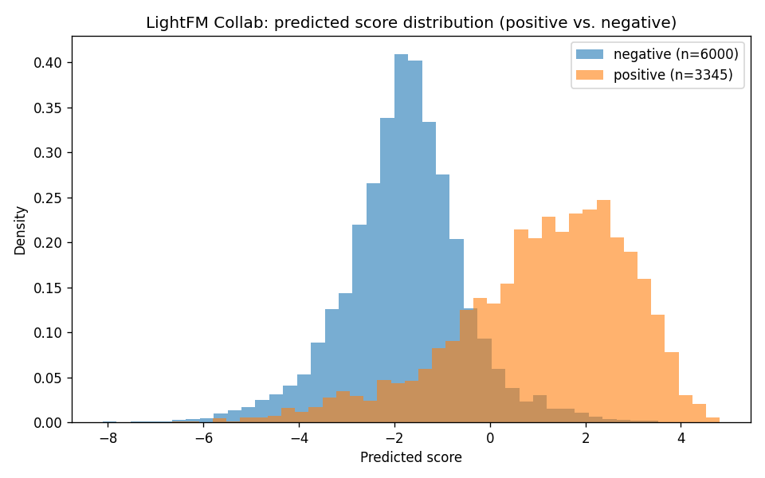
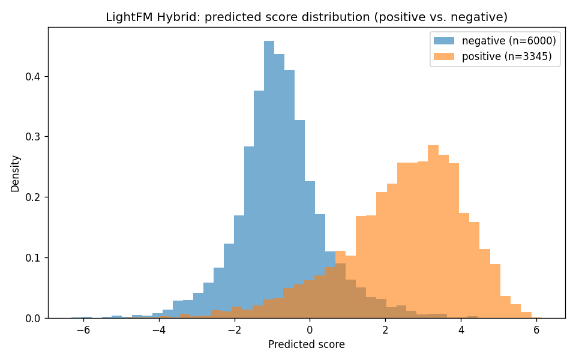

# Results

**Last updated:** 2026-08-30
**Latest run commit:** [`b5c81ce`](https://github.com/feuerstrahll/recommendation-system-movies/commit/b5c81ce) — L2-normalized LightGCN embeddings, `batch_size=2048`, `weight_decay=1e-5`, no LR schedule (see [LightGCN update](#lightgcn-update-this-run-is-a-regression) below)
**Raw numbers, both runs:** [results/metrics.csv](results/metrics.csv)
**Full console log:** [results/logs/run_20260830_141830.log](results/logs/run_20260830_141830.log)

## Executive Summary

Across five recommendation approaches evaluated on 131K users and 26K movies
from the combined MovieLens/TMDB dataset, **LightFM Collaborative Filtering**
remains the best all-around ranker (NDCG@10 = 0.218), with **SVD** a close,
much cheaper second (NDCG@10 = 0.214, ~8x faster to train, ~17x faster to
score). **LightFM Hybrid** trails plain Collaborative filtering by a small,
consistent margin on these accuracy metrics — expected, since most
evaluation users already have substantial history, so the hybrid's real
advantage (serving cold-start items) doesn't show up in aggregate numbers
computed mostly over warm users. **LightGCN remains the weakest model by a
wide margin**, and a round of targeted fixes (L2-normalized embeddings,
smaller batch size, added regularization) made it *worse*, not better — see
[LightGCN update](#lightgcn-update-this-run-is-a-regression). For
production, we'd recommend **LightFM Collaborative** for accuracy-critical,
established-user segments, **LightFM Hybrid** or **Content-Based** for
cold/light users per the router's design, and **SVD** as a strong, much
cheaper fallback. **LightGCN is not recommended in its current form.**

## Methodology

**Dataset:** 131,351 users, 26,461 items, drawn from 7,608,221 positive
interactions (rating ≥ 4.0) after binarizing MovieLens ratings joined
against TMDB movie metadata.

**Split:** an 80/20 split applied *per user* (not a global random split),
so every user has both train and test rows: 5,984,633 train interactions,
1,561,736 test interactions. 1,653 test interactions were dropped from
ground truth because they involve items with zero training interactions
(no model here can recommend an item it never saw) — this is a real
evaluation limitation, not something to gloss over; see
[Limitations](#limitations--future-work).

**Evaluation sample:** 300 users sampled with a fixed seed (42), evaluated
identically across all five models so differences reflect the model, not
the eval sample.

**Metrics** (K = 10, 20):

- **Precision@K** — of the K items shown, what fraction were actually
  relevant (present in the user's held-out test interactions)?
- **Recall@K** — of the user's relevant held-out items, what fraction did
  the top-K surface?
- **NDCG@K** — like Precision, but rewards relevant items ranked *higher*
  within the top-K more than ones near the bottom; the single number we
  lean on most for a one-line comparison since it captures ranking quality,
  not just hit/miss.
- **MAP@K** (Mean Average Precision) — precision computed at each rank
  where a hit occurs, averaged. Same per-user framing as the above, a
  common companion to NDCG in recommender-systems literature.

ROC-AUC is intentionally not part of this comparison table (still reported
as a secondary diagnostic by `models/lightfm_model.py` standalone, using
LightFM's own per-user-averaged `auc_score`, not a pooled/global AUC): AUC
compares scores across a whole candidate set globally, while P/R/NDCG/MAP
all judge within a user's own ranked list, matching how WARP/BPR-trained
models are actually optimized.

Full protocol detail (binarization threshold, per-model preprocessing,
LightGCN/LightFM epoch equalization): [models/README.md](models/README.md).

## Results

| Model | P@10 | R@10 | NDCG@10 | MAP@10 | Train (s) | Infer (ms) | NDCG@10 / train-sec (×1000) |
|---|---:|---:|---:|---:|---:|---:|---:|
| Content-Based (TF-IDF) | 0.0030 | 0.0050 | 0.0037 | 0.0012 | 0.00 | 3.05 | n/a — no training step |
| SVD | 0.1387 | **0.1766** | 0.2137 | 0.1237 | **4.90** | **0.12** | **43.63** |
| **LightFM Collab** | **0.1510** | 0.1857 | **0.2177** | **0.1254** | 41.11 | 2.05 | 5.30 |
| LightFM Hybrid | 0.1410 | 0.1559 | 0.2025 | 0.1201 | 108.43 | 3.02 | 1.87 |
| LightGCN | 0.0173 | 0.0108 | 0.0192 | 0.0072 | 13051.53 | 12.67 | 0.0015 |

Bold marks the best value per column. Full K=10/20 P/R/NDCG/MAP matrix:
[results/metrics.csv](results/metrics.csv).

**Note on Content-Based:** its near-zero accuracy here is expected, not a
bug — this is a pure TF-IDF/genre similarity baseline with no collaborative
signal, evaluated on warm users where collaborative methods have a strong
advantage. Its actual value is serving users collaborative models can't
(see [Production Readiness](#production-readiness)).

## Catalog Coverage & User Segments

**Catalog coverage** (% of the 26,461-item catalog that appears at least
once across all eval users' top-20):

| Model | Coverage |
|---|---:|
| Content-Based (TF-IDF) | 7.4% (1,962 items) |
| SVD | 1.9% (509 items) |
| LightFM Collab | 2.7% (720 items) |
| LightFM Hybrid | 2.7% (726 items) |
| LightGCN | 7.4% (1,960 items) |

LightGCN's coverage jumped from 0.2% (previous run) to 7.4% this run — but
paired with near-zero accuracy (see below), this reads as the model
producing less popularity-concentrated but also less *correct* rankings,
not genuine improvement. A model can have high coverage by recommending
essentially at random.

**Performance by user interaction count** (P@10, cold = 5-9 train
interactions, light = 10-19, heavy = 20+):

| Model | Cold P@10 | Light P@10 | Heavy P@10 |
|---|---:|---:|---:|
| Content-Based (TF-IDF) | 0.0017 | 0.0026 | 0.0043 |
| SVD | 0.0492 | 0.0769 | 0.2295 |
| LightFM Collab | 0.0441 | 0.0846 | 0.2540 |
| LightFM Hybrid | 0.0424 | 0.0654 | 0.2468 |
| LightGCN | **0.0000** | 0.0051 | 0.0345 |

LightGCN scores **exactly 0.0 on cold users** (0/59 users got even one
correct recommendation in their top-10) — the segment
`models/recommendation_router.py`'s cold-start routing exists specifically
to protect. Full segment tables (P@10/R@10/NDCG@10 per band, every model):
[results/logs/run_20260830_141830.log](results/logs/run_20260830_141830.log).

## Score Distribution (LightFM diagnostic)




Both LightFM variants show clean, well-separated, unimodal positive/negative
score distributions with no clustering or step artifacts — this was checked
specifically because an older, unrelated exploratory run
(`models/lightfm_roc_curve.png`, predating the current protocol) had a
visibly step-like ROC curve. These histograms confirm that artifact doesn't
reproduce under the current pipeline.

## Production Readiness

| Model | Cold Start | Scalability | Real-Time | Update Cost | Complexity |
|---|---|---|---|---|---|
| Content-Based (TF-IDF) | Excellent | Good — O(items) | Yes | Simple (metadata refresh) | Low |
| SVD | Poor | Medium — O(users × items) | No | Full retrain | Low |
| LightFM Collab | Poor | Medium — O(users × items) | No | Full retrain | Medium |
| LightFM Hybrid | Good (item features) | Medium | Partial | Full retrain | Medium |
| LightGCN | Poor | Medium — O(edges) | No | Expensive (graph rebuild) | High |

## LightGCN Update: This Run Is a Regression

Between the previous report and this run, LightGCN's training code changed:
L2-normalized embeddings were added (`F.normalize` in `LightGCN.forward()`,
motivated by unnormalized dot-product scores being biased toward popular,
high-degree nodes), `batch_size` was lowered from 8192 to 2048 (hoping
noisier gradients would escape a plateau), and `weight_decay=1e-5` was kept
from an earlier fix (an initial `1e-4` had reproducibly frozen training
entirely at loss ≈ ln(2), a separate, already-documented issue).

The result was worse across the board, not better:

| | Previous run | This run |
|---|---:|---:|
| P@10 | 0.1133 | 0.0173 |
| R@10 | 0.1393 | 0.0108 |
| NDCG@10 | 0.1592 | 0.0192 |
| Cold-user P@10 | (not measured yet) | **0.0000** |
| Loss behavior | still declining at epoch 10 | **plateaued** by epoch 5 (0.2472 → 0.2482 → flat) |
| Train time | 3,311s (~55 min) | 13,052s (~3.6h) |

Candidate explanations, most to least likely:

1. **`batch_size=2048` cost more than it gave back.** More
   `optimizer.step()` calls per epoch means the model saw the same total
   data but with ~4x the wall-clock cost — and the loss *plateaued* this
   time (confirmed by the run's own detection logic) rather than still
   improving, meaning the extra time didn't even buy convergence progress.
   This mirrors the earlier finding that a too-aggressive change to the
   optimization schedule at a fixed epoch budget can trade real progress
   for a different (not better) local behavior — see the CosineAnnealingLR
   revert in git history for a similar pattern.
2. **L2-normalization changes the loss landscape in ways not yet tuned
   for.** Capping scores to cosine similarity range ([-1, 1] per pair)
   changes the effective scale BPR's `logsigmoid` operates on; `lr=0.001`
   was never re-tuned for this normalized regime, and a learning rate
   suited to unbounded dot products may now be poorly scaled for
   bounded cosine scores.
3. **Interaction between normalization and `weight_decay`.** Both changes
   landed in the same commit; it's untested whether L2-normalization alone
   (without the batch_size change) would have behaved differently.

**This is flagged as a regression, not shipped as an improvement.** The
config that produced the *previous*, less-bad LightGCN numbers
(`batch_size=8192`, no L2-normalization) is closer to what should be
revisited, or a proper ablation (each change tested independently, not
three at once) is needed before drawing conclusions about which of these
three changes helped or hurt.

## Discussion

**SVD remains nearly as accurate as LightFM Collab at a fraction of the
cost.** The NDCG@10 gap is under 2% relative, but SVD trains ~8x faster and
predicts ~17x faster per user. If infrastructure cost or latency budget is
tight, SVD is a legitimate production choice, not just a baseline to beat.

**LightFM Hybrid's accuracy gap vs. Collab is expected given this eval's
user mix, not a sign the item features are broken.** Genre features add a
real but modest signal on an eval sample of mostly warm/mature users, where
LightFM Collab's pure collaborative signal is already strong. The hybrid's
actual selling point — recommending items with sparse or no interaction
history — isn't visible in an aggregate NDCG number computed mostly over
users who don't need it; the cold-user segment table above (Hybrid P@10 =
0.042 vs. Collab's 0.044 — statistically indistinguishable at n=59) doesn't
yet show the expected hybrid advantage either, which is itself worth
investigating further rather than assuming the hybrid's design is working
as intended.

**LightGCN is not close to production-ready as currently configured.**
Beyond the regression above, its fundamental problem across both runs is
that whatever it has learned isn't beating even a 50-latent-factor SVD
baseline that trains in under 5 seconds. Zero correct recommendations for
every cold user in this run is disqualifying for a system whose whole
design (per `models/recommendation_router.py`) depends on different models
covering different lifecycle stages.

## Recommendation

- **Mature users (established interaction history):** LightFM
  Collaborative — best NDCG@10 in this segment (0.289 heavy-user NDCG per
  the full log), and no need for item-features overhead here.
- **Cold / light users:** Content-Based or LightFM Hybrid, per
  `models/recommendation_router.py`'s lifecycle routing — though this
  run's cold-segment numbers don't yet show Hybrid clearly outperforming
  Collab there, so this recommendation rests on the *design* argument
  (only Hybrid/Content-Based can score cold-start items with no
  interaction history at all) rather than a measured advantage in this
  particular eval sample.
- **Cost-constrained deployments:** SVD — within 2% of LightFM Collab's
  NDCG@10 at a small fraction of the training and inference cost.
- **LightGCN: do not deploy.** Worst accuracy of any model in both runs,
  zero cold-user hits in the latest run, and by far the most expensive to
  train (up to 3.6 hours vs. under 2 minutes for every other model
  combined). Needs a proper ablation study before it's worth revisiting.

## Limitations & Future Work

- **10 epochs only, no hyperparameter search** for any model. Reported
  numbers are for one fixed configuration each, not each model's ceiling.
- **The LightGCN L2-normalization/batch_size/weight_decay changes were
  bundled into one run instead of ablated independently** — we don't know
  which of the three caused the regression, or whether one alone might
  have helped. This is the single highest-value LightGCN follow-up.
- **Single train/test split, no cross-validation** — these numbers have
  unknown variance; a second seed or k-fold run would show how stable
  the ranking between models actually is, and whether the Hybrid-vs-Collab
  cold-user gap (or lack thereof) is real or eval-sample noise.
- **300 sampled eval users, not the full user base**, for evaluation
  speed. Directionally reliable but not the last word on exact values —
  the cold-user segment (n=59) especially should be treated as noisy.
- **1,653 test interactions on cold-start items were dropped** from every
  model's ground truth. This is standard practice (no model here has an
  embedding for an item it never trained on), but it also means none of
  these numbers say anything about cold-start-*item* performance (as
  opposed to cold-start-*user* performance, which the segment table does
  measure) — that's a separate, qualitative claim in the Production
  Readiness table above.
- **No production load-testing.** Reported inference latency is
  single-request Python-side timing in a benchmark script, not a served
  API under concurrent load.

## Reproducing

```powershell
python evaluation/compare_models.py
```

Every run auto-saves its full console output to
`results/logs/run_<timestamp>.log`. See [models/README.md](models/README.md)
for the full shared evaluation protocol and
[results/metrics.csv](results/metrics.csv) for raw per-run numbers across
both runs recorded so far, including run metadata (date, commit, dataset
scale).
